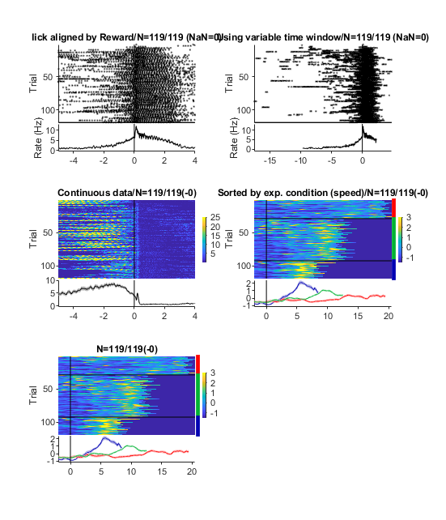
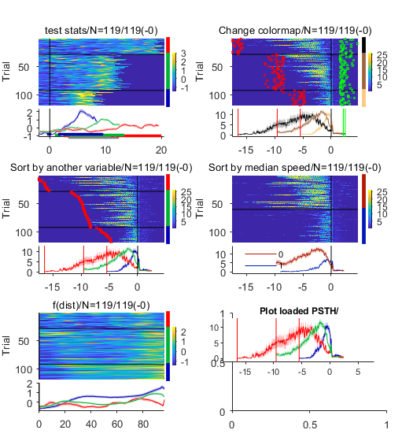

# libtimeseries
libtimeseries provides an integrative way to plot and manage behavioral and neural time course data. It is specialized in handling trial structure with multiple conditions and differen events.

see demo_timecourse_data_analysis.m for a demo with detailed comments.

# What you can do

- plot a PSTH (show raster + average across trials for each condition)
- save a PSTH
- load multiple PSTHs
- filter PSTHs
- combine PSTHs with different time range (e.g., homogenize x axis of PSTHs)
- plot individual or population PSTHs
- perform multi-dimensional population analyses

# Examples

# Tips

use [panel](https://www.mathworks.com/matlabcentral/fileexchange/20003-panel) for more packed plots
